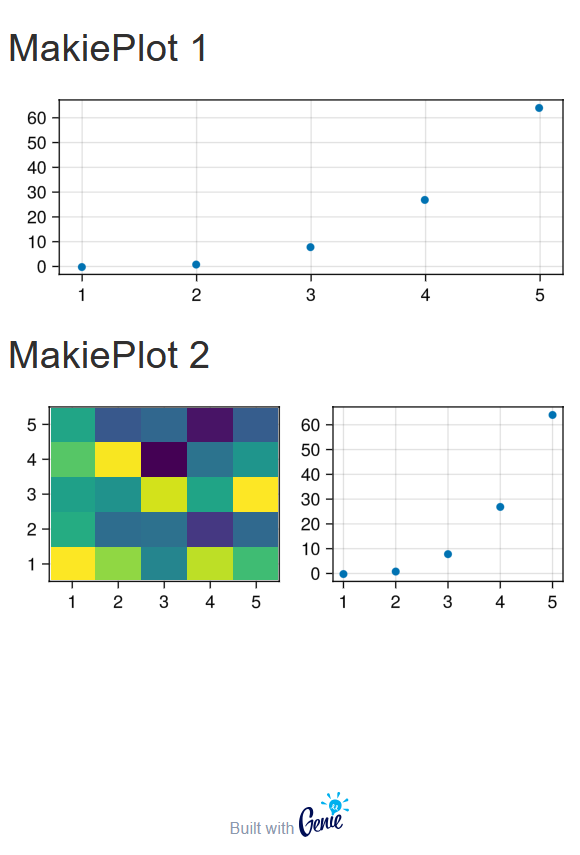

# StippleMakie

StippleMakie is a plugin for the GenieFramework to enable Makie plots via WGLMakie


### Demo App
Don't be surprised if the first loading time of the Webpage is very long (about a minute).
```julia
using Stipple
using Stipple.ReactiveTools
using StippleUI

using StippleMakie

Stipple.enable_model_storage(false)

# ------------------------------------------------------------------------------------------------

# if required set a different port, url or proxy_port for Makie's websocket communication, e.g.
# otherwise, Genie's settings are applied for listen_url and proxy_url and Makie's (Bonito's) settings are applied for the ports
configure_makie_server!(listen_port = 8001)

# Example settings for a proxy configuration:
# configure_makie_server!(listen_port = 8001, proxy_url = "/makie", proxy_port = 8080)


# The appropriate nginx configuration can be generated using `nginx_config()` either after setting the configuration
# or by passing the desired settings directly to the function.
# nginx_config()

@app MakieDemo begin
    @out fig1 = MakieFigure()
    @out fig2 = MakieFigure()
    @in hello = false

    @onbutton hello @notify "Hello World!"

    @onchange isready begin
        init_makiefigures(__model__)
        # the viewport changes when the figure is ready to be written to
        onready(fig1) do
            Makie.scatter(fig1.fig[1, 1], (0:4).^3)
            Makie.heatmap(fig2.fig[1, 1], rand(5, 5))
            Makie.scatter(fig2.fig[1, 2], (0:4).^3)
        end
    end
end


UI::ParsedHTMLString = column(style = "height: 80vh; width: 98vw", [
    h4("MakiePlot 1")
    cell(col = 4, class = "full-width", makie_figure(:fig1))
    h4("MakiePlot 2")
    cell(col = 4, class = "full-width", makie_figure(:fig2))
    btn("Hello", @click(:hello), color = "primary")
])

ui() = UI

route("/") do
    WGLMakie.Page()
    global model = @init MakieDemo    
    html!(ui, layout = Stipple.ReactiveTools.DEFAULT_LAYOUT(head_content = [makie_dom(model)]), model = model, context = @__MODULE__)

    # alternatively, you can use the following line to render the page without the default layout
    # page(model, ui, prepend = makie_dom(model)) |> html
end

up(open_browser = true)
```


As WGLMakie needs its own websocket port to communicate with the plots, operation behind a proxy needs more careful proxy setup.
After setting up the server, e.g. with `configure_makie_server!(listen_port = 8001, proxy_base_path = "/makie")`, `nginx_conf()` returns a valid
configuration for an nginx server to accomodate running Genie and Makie over the same port.
Here's the nginx configuration for above configuration.

```
http {
    upstream makie {
        server localhost:8001;
    }

    upstream genie {
        server localhost:8000;
    }

    server {
        listen 8080;

        # Proxy traffic to /makie/* to http://localhost:8001/*
        location /makie {
            proxy_pass http://makie/;
            
            # WebSocket headers
            proxy_http_version 1.1;
            proxy_set_header Upgrade $http_upgrade;
            proxy_set_header Connection "upgrade";
            
            # Preserve headers
            proxy_set_header Host $host;
            proxy_set_header X-Real-IP $remote_addr;
            proxy_set_header X-Forwarded-For $proxy_add_x_forwarded_for;
            proxy_set_header X-Forwarded-Proto $scheme;
        }

        # Proxy all other traffic to http://localhost:8000/*
        location / {
            proxy_pass http://genie/;

            # WebSocket headers
            proxy_http_version 1.1;
            proxy_set_header Upgrade $http_upgrade;
            proxy_set_header Connection "upgrade";
            
            # Preserve headers
            proxy_set_header Host $host;
            proxy_set_header X-Real-IP $remote_addr;
            proxy_set_header X-Forwarded-For $proxy_add_x_forwarded_for;
            proxy_set_header X-Forwarded-Proto $scheme;
        }
    }
}
```
